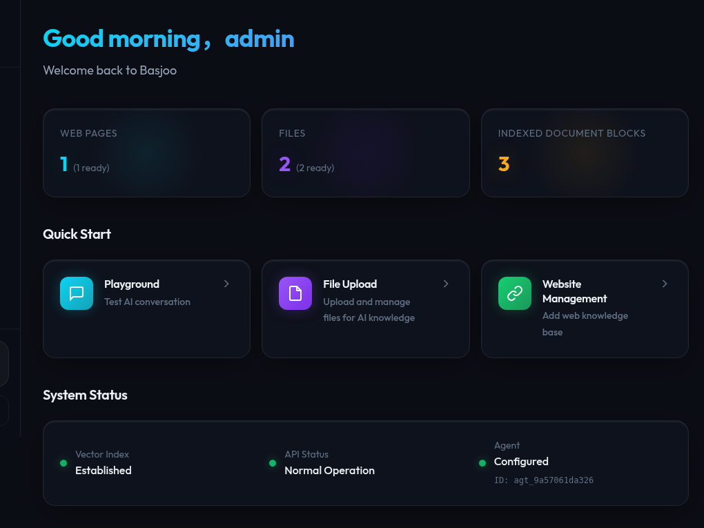
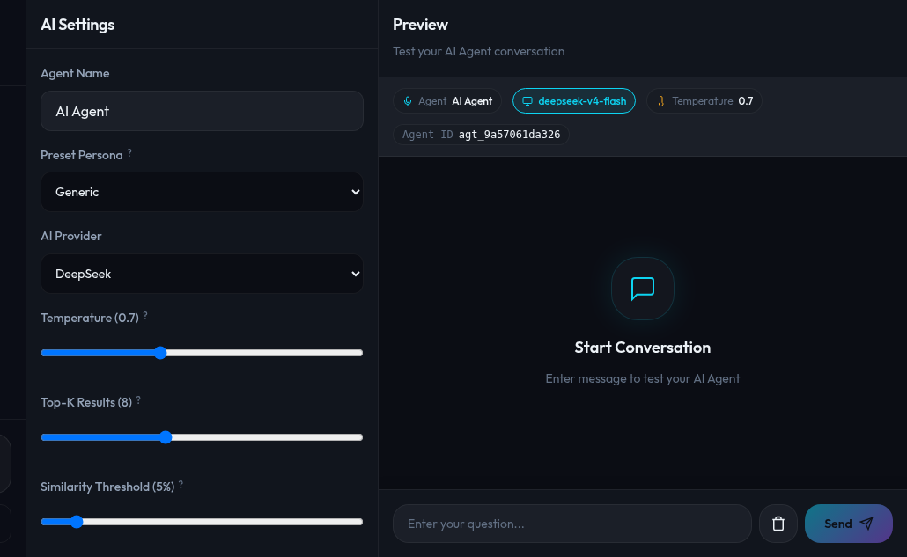
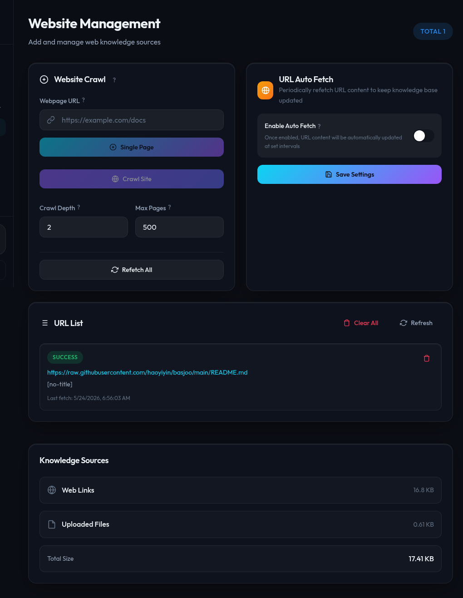
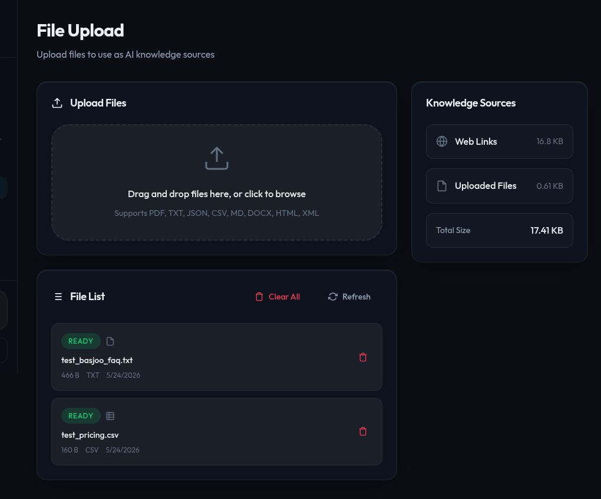
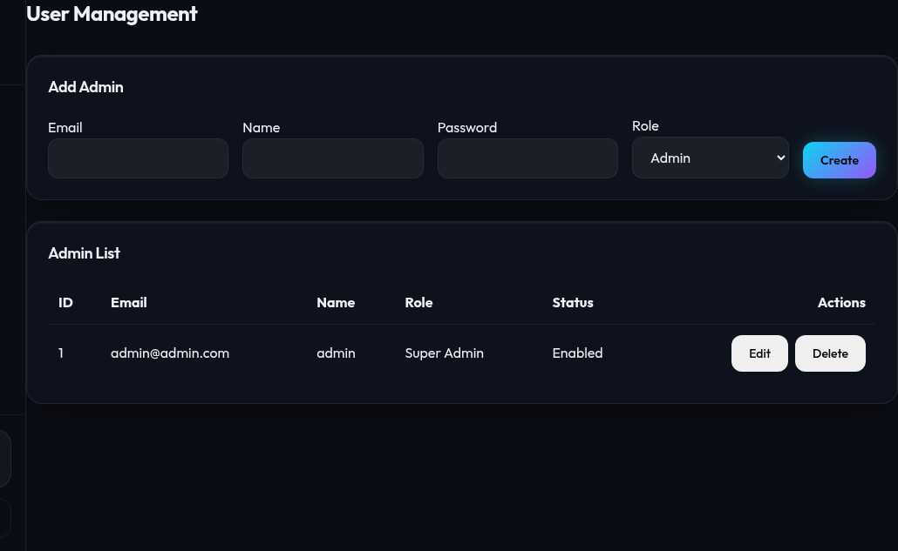
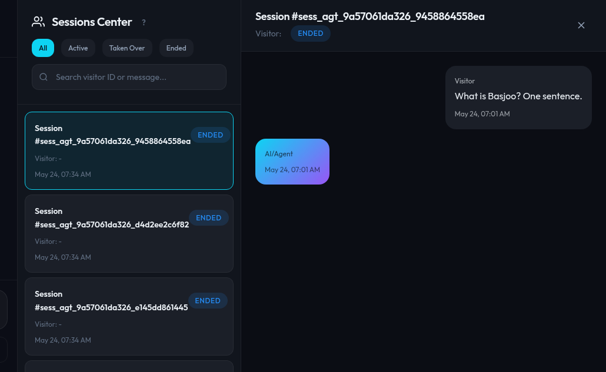
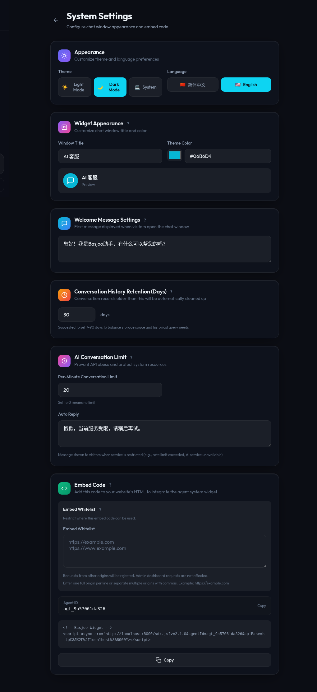
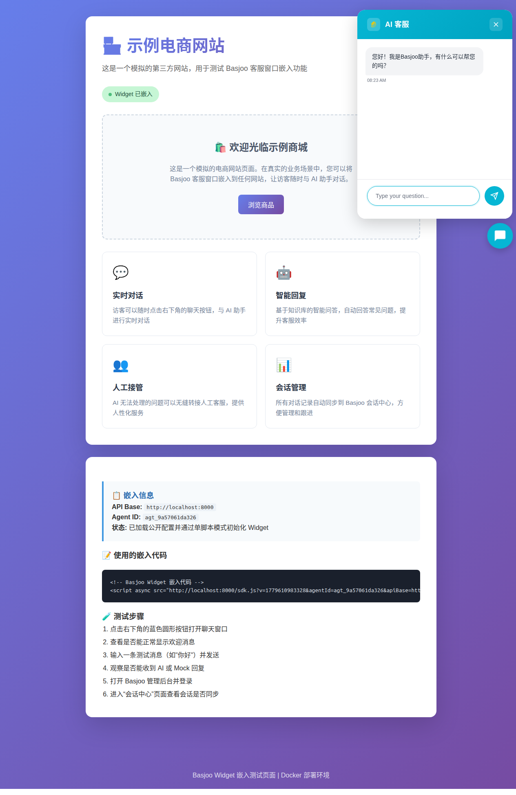

# SupportIQ

> SupportIQ — AI-powered customer support platform with RAG, multi-agent orchestration, and embeddable chat widget.

[](https://www.docker.com/)
[](https://fastapi.tiangolo.com/)
[](https://nextjs.org/)
[](https://www.python.org/)
[](https://www.typescriptlang.org/)
[](https://www.postgresql.org/)
[](https://redis.io/)
[](https://qdrant.tech/)
[](https://github.com/D4Vinci/Scrapling)

SupportIQ is an AI customer-support platform with three main parts:

- a **FastAPI backend** for agent configuration, chat, indexing, auth, and scheduling
- a **Next.js admin/dashboard frontend** in `frontend-nextjs/`
- an **embeddable chat widget** in `widget/` that talks to the backend over HTTP and SSE

The stack also uses **SQLite** for application data, **Redis** for rate limiting, **Qdrant** for vector search and document indexing, **PostgreSQL** for relational data, a **Scrapling microservice** for web content fetching, and **nginx** for Docker-based reverse proxying.

## System requirements

SupportIQ runs as a set of Docker containers. All LLM inference and embedding calls are made to external APIs (OpenAI, DeepSeek, Anthropic, Gemini, Jina, SiliconFlow), so **no GPU is required**.

| | Minimum | Recommended |
|---|---|---|
| CPU | 2 vCPU | 2–4 vCPU |
| RAM | 4 GB | 8 GB |
| Disk | 20 GB | 50 GB |
| OS | Ubuntu 22.04+ / Debian 11+ | Ubuntu 22.04+ / Debian 12+ |
| Docker | 20.10+ | latest |

## Automatic deployment

For a blank Ubuntu or Debian server, run:

```bash
curl -fsSL https://raw.githubusercontent.com/your-org/supportiq/main/install-deploy.sh | sudo sh
```

If you already have this repository checked out locally, you can also run:

```bash
sudo sh install-deploy.sh
```

After deployment completes, the script prints a prominent summary with the admin dashboard URL. On local desktop environments (with `DISPLAY` or `WAYLAND_DISPLAY` set), it may automatically open the URL in your browser. On headless servers, copy the printed link into a browser.

The first registered admin becomes the workspace super administrator, who can create and manage multiple isolated AI agents within the same workspace.

## Repository structure

- `backend/` — FastAPI app, data models, chat APIs, auth, ingestion, indexing, tests
- `frontend-nextjs/` — active admin/dashboard UI
- `widget/` — embeddable chat widget bundle
- `scrapling-service/` — standalone microservice for web content fetching (curl_cffi + readability)
- `nginx/` — Docker nginx config
- Qdrant vector database service configuration
- `docker-compose.yml` — dev/prod orchestration

## Core features

- Configurable AI agents with multiple provider settings
- Independent Embedding API selection for knowledge retrieval: Jina or SiliconFlow
- URL ingestion and file knowledge management
- Self-KB retrieval (Qdrant-backed) and document indexing via KB pipeline
- Streaming chat responses over Server-Sent Events
- Embeddable website widget with session persistence
- Widget copy auto-translation by visitor locale
- Per-agent widget domain whitelist for public chat embeds
- Offline agent fallback replies and admin-side error alerts
- Admin authentication and dashboard management flows
- Dockerized development and production-style deployment paths

## Feature walkthrough

### Admin dashboard overview

The admin dashboard is the operational center for configuring agents, reviewing knowledge coverage, and accessing the major management modules.



### Playground and AI configuration

The Playground lets admins test replies, inspect retrieval behavior, and adjust model/provider settings from the same workflow.



### Website knowledge management

The Websites page handles URL ingestion, crawling, auto-fetch settings, and retraining/index-refresh workflows for web content.



### File knowledge management

The File Upload page lets you drag-and-drop PDF, TXT, CSV, Markdown, DOCX and other files as knowledge sources for AI retrieval.



### User management

Manage admin accounts with role-based access control — Super Admin, Admin, and Support roles.



### Session operations

The Sessions page shows live conversations, supports human takeover, and gives operators a single place to monitor visitor activity.



### Agent settings and widget appearance

Agent Settings covers language/theme preferences, widget appearance, embed behavior, and other operational controls.



### Embedded widget experience

The widget provides the visitor-facing chat window with persisted sessions, multilingual copy, streaming responses, and knowledge-assisted replies.



## Tech stack

### Backend

- FastAPI
- SQLAlchemy async + SQLite
- Redis (rate limiting, caching)
- Qdrant REST API (vector search, document ingestion, hybrid retrieval)
- PostgreSQL (application data persistence)
- Scrapling microservice (curl_cffi + readability-lxml web content extraction)
- APScheduler
- Provider SDKs for OpenAI-compatible APIs, Anthropic, and Google Gemini

### Frontend

- Next.js 14
- React 18
- TypeScript
- i18next

### Widget

- TypeScript
- esbuild
- Browser-native fetch + SSE handling

## Manual deployment

### Option 1: Docker Compose

Development stack:

```bash
docker compose --profile dev up -d
```

Production-style stack:

```bash
docker compose --profile prod up -d
```

Useful Docker commands:

```bash
docker compose logs -f backend-dev frontend-dev nginx
docker compose --profile dev up -d --build backend-dev frontend-dev
bash scripts/prod_stability_check.sh
```

Default dev ports:

- Frontend: `http://localhost:3000`
- Backend API: `http://localhost:8000`
- Qdrant: `http://localhost:6333`
- PostgreSQL: `127.0.0.1:5432`
- Redis: `127.0.0.1:6379`

The dev frontend and backend ports are bound as `3000:3000` and `8000:8000`, so they are reachable from other devices that can access the host.

### Option 2: Run services locally

#### Backend

```bash
cd backend
python3 -m venv venv
source venv/bin/activate
pip install -r requirements.txt
python3 main.py
```

Backend health check:

```bash
curl http://localhost:8000/health
```

#### Frontend

```bash
cd frontend-nextjs
npm install
npm run dev
```

#### Widget

```bash
cd widget
npm install
npm run dev
```

## Common development commands

### Frontend (`frontend-nextjs/`)

```bash
npm install
npm run dev
npm run build
npm run start        # production build locally
npm run lint
npm run typecheck
npm run test         # vitest
```

### Widget (`widget/`)

```bash
npm install
npm run dev          # dev bundle + example server
npm run build        # full build (typecheck + dev + prod bundles)
npm run build:dev    # unminified ESM bundle (dist/supportiq-widget.js)
npm run build:prod   # minified IIFE bundle (dist/supportiq-widget.min.js)
npm run typecheck
npm run test         # vitest
```
